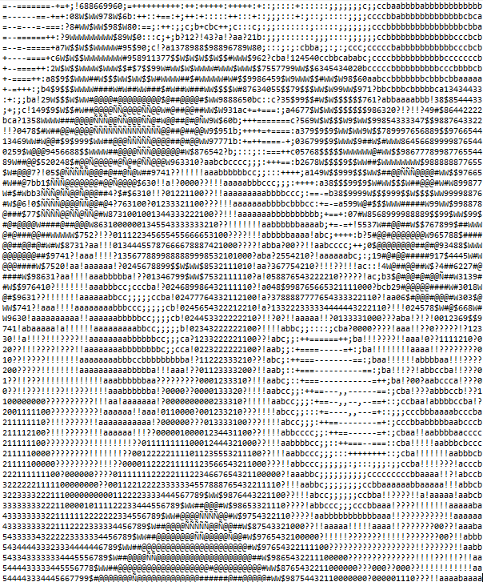

# image2ascii

An Image to ascii tool. Written in Rust.

# Example #
Original photo<br><br>
<br><br>
ASCII result<br><br>

# Build #
Build via cargo
```
cargo build
```
# Usage #
```
./image2ascii IMAGE_PATH
```